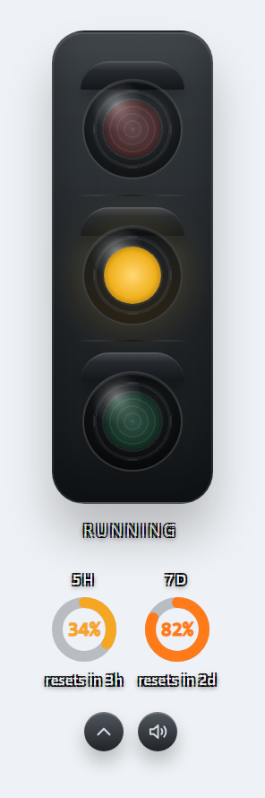
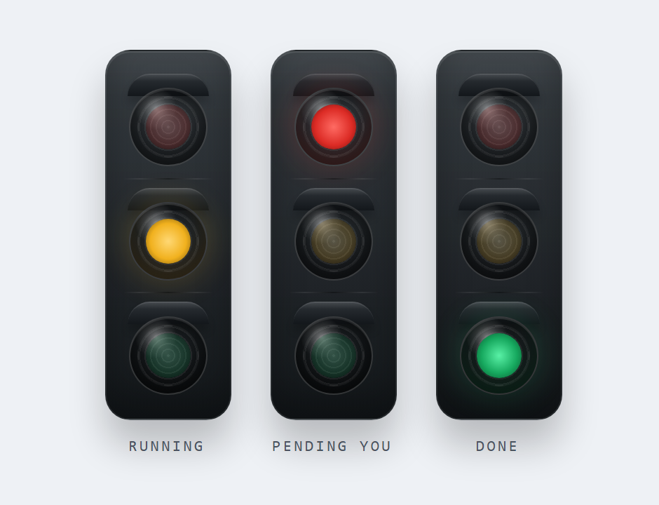

# Claude Status Light

Floating desktop traffic light for the Claude Code plugin inside VS Code on macOS and Windows.

Claude Status Light sits on your desktop and mirrors Claude Code session state in one glance while you work in VS Code:

- `yellow solid` = Claude is running
- `red blinking` = Claude is waiting for you
- `green solid` = Claude answered and is done with the current turn

<p align="center">
  
</p>

It is built with `Tauri + React`, plus a small local hook bridge that listens to Claude Code hooks and writes shared state for the desktop app.

Current scope:

- supported workflow: Claude Code inside VS Code
- current docs and release testing are written around the VS Code plugin flow
- other Claude Code surfaces may work if they emit the same hooks, but they are not the primary documented target today

## What's New in 0.2.0

- **Plan usage dials** — Session (5h) and Weekly (7d) usage, mirrored from Claude Code's `/usage`, shown as two ring gauges below the light. Orange-yellow under 80%, orange at 80%+.
- **Show/Hide Details** — collapse everything below the traffic light down to a compact signal, from the tray menu or the in-window chevron button; the window resizes to match.
- **Sharper contrast** — status and usage text now stay legible on any desktop wallpaper.

## Why

Claude Code inside VS Code often lives inside a busy editor window. This app makes status ambient:

- keep coding or reading on another screen
- notice immediately when Claude needs input
- hear a sound when status changes
- glance at your Claude plan usage (5-hour and weekly windows)
- run the same idea on Windows and macOS

## Download

Releases: [github.com/guu5ama/claude-status-light/releases](https://github.com/guu5ama/claude-status-light/releases)

Current release assets:

- Windows installer: `.exe`
- Windows installer: `.msi`
- Windows portable: `.zip`
- macOS test build: unsigned `aarch64 .dmg`

macOS note:

- the current DMG is for Apple Silicon
- it is unsigned, so Gatekeeper warnings are expected during testing

## How It Works

1. Claude Code fires hooks for `UserPromptSubmit`, `Notification`, `PreToolUse(AskUserQuestion)`, and `Stop`.
2. `bridge/claude-hook.mjs` receives the hook payload on `stdin`.
3. The bridge writes normalized state to a shared `state.json`.
4. The desktop app polls that state and updates the light and sounds.

The app also tries to configure Claude hooks automatically on startup.

## Scope

This project is currently aimed at one main use case:

- you use Claude Code inside VS Code
- you want a floating desktop indicator outside the editor
- you want hook setup to be mostly automatic

The underlying hook system is shared Claude Code behavior, so other surfaces may work. But the README, release flow, and troubleshooting guidance are intentionally centered on the VS Code plugin experience first.

## Status Semantics

<p align="center">
  
</p>

- `UserPromptSubmit` -> `running`
- `Notification(permission_prompt | idle_prompt | elicitation_dialog)` -> `pending_user`
- `PreToolUse(AskUserQuestion)` -> `pending_user`
- `Stop`:
  - wait-for-user language -> `pending_user`
  - explicit completion language -> `done`
  - direct answer with no follow-up request -> `done`

This means a plain factual answer should turn green even if it does not literally say "done".

## Plan Usage

Below the traffic light, two circular dials mirror the same plan usage shown by Claude Code's `/usage`:

- `5H` = the 5-hour session window
- `7D` = the 7-day weekly window

Each dial shows the percentage used in the center and `resets in Xh` below. The ring and percentage are orange-yellow below 80% and orange at 80% and above.

How it is fetched:

- the Tauri backend reads your OAuth token from `~/.claude/.credentials.json` (the same credentials Claude Code uses) and calls the official `https://api.anthropic.com/api/oauth/usage` endpoint
- it is polled at a low frequency (every 5 minutes) because the endpoint rate-limits aggressively
- on any error the last known values are kept; nothing is ever sent anywhere, usage percentages are only read back for display
- if the token is expired or no data has been fetched yet, the dials simply do not appear

## Automatic Hook Setup

On startup, the app tries to manage `~/.claude/settings.json` for you.

Behavior:

- merges only the Claude Status Light hooks it needs
- preserves unrelated existing hooks
- backs up the original `settings.json` before any real write
- treats the current app location as the only valid Claude Status Light bridge path
- removes stale Claude Status Light paths from old repos or moved portable folders
- tolerates UTF-8 BOM in `settings.json`

If the app rewrites hooks:

- it shows `HOOKS UPDATED`
- it shows the active bridge path and backup path
- the Claude Code panel in VS Code should be reopened so it reloads the new hook path

Tray controls:

- `Open/Hide`
- `Sound On/Off`
- `Show/Hide Details`
- `Configure Claude Hooks`
- `Reconnect Session`
- `Quit`

`Reconnect Session` resets binding to `idle_unbound` so the next real Claude event can claim the app cleanly.

`Show/Hide Details` (also available as the chevron button in the window) collapses the area below the traffic light and shrinks the window down to just the light and the control buttons.

## End-User Notes

Windows:

- Claude settings path: `C:\Users\<user>\.claude\settings.json`
- installed and portable builds store runtime state under local app data

macOS:

- Claude settings path: `/Users/<user>/.claude/settings.json`
- app ships as native `.app` / `.dmg`, not Docker

Sounds:

- prefer local MP3 assets in `public/sounds/`
- fall back to synthesized tones if file playback is unavailable

## Development

Requirements:

- Node.js 20+
- npm
- Rust + Cargo
- Tauri prerequisites for your platform

Platform prerequisites:

- Windows: Visual Studio C++ Build Tools
- macOS: Xcode Command Line Tools via `xcode-select --install`

Install:

```powershell
npm install
```

Run tests and frontend build:

```powershell
npm test
npm run build
```

Run desktop app in development:

```powershell
npm run tauri:dev
```

Build release packages:

Windows:

```powershell
npm run tauri:build:windows
```

macOS:

```bash
npm run tauri:build:mac
```

Important:

- run `npm run tauri:build:windows` on Windows
- run `npm run tauri:build:mac` on a Mac, or use the GitHub Actions macOS workflow

## Manual Hook Example

Automatic setup is the default and recommended path. For development or troubleshooting, a local checkout can be wired manually like this:

```json
{
  "hooks": {
    "UserPromptSubmit": [
      {
        "matcher": "",
        "hooks": [
          {
            "type": "command",
            "command": "node \"C:/code/claude-status-light/bridge/claude-hook.mjs\""
          }
        ]
      }
    ],
    "Notification": [
      {
        "matcher": "",
        "hooks": [
          {
            "type": "command",
            "command": "node \"C:/code/claude-status-light/bridge/claude-hook.mjs\""
          }
        ]
      }
    ],
    "PreToolUse": [
      {
        "matcher": "AskUserQuestion",
        "hooks": [
          {
            "type": "command",
            "command": "node \"C:/code/claude-status-light/bridge/claude-hook.mjs\""
          }
        ]
      }
    ],
    "Stop": [
      {
        "matcher": "",
        "hooks": [
          {
            "type": "command",
            "command": "node \"C:/code/claude-status-light/bridge/claude-hook.mjs\""
          }
        ]
      }
    ]
  }
}
```

After manual edits:

1. Reopen Claude Code.
2. Click `Reconnect Session`.
3. Send a new Claude message.

Bridge details: [bridge/README.md](bridge/README.md)

## Troubleshooting

`The light stays idle_unbound`

- Claude hooks are missing or malformed in `~/.claude/settings.json`
- the Claude Code panel in VS Code has not been reopened after hook changes
- `Reconnect Session` was not used after manual bridge tests

`The label says SETUP NEEDED`

- automatic Claude hook configuration failed
- rerun `Configure Claude Hooks`
- inspect `~/.claude/settings.json`
- enable debug logging if needed

`The light stays yellow forever`

- check whether `Stop` is arriving
- check whether `PreToolUse(AskUserQuestion)` is configured
- inspect `lastMessageText` in the state file

`macOS build exists but the app will not open`

- unsigned local builds may be blocked by Gatekeeper
- wider distribution will need Apple signing and notarization

## macOS Verification

Current verification status:

- GitHub Actions `macOS Verify` passes on `macos-latest`
- the workflow runs `npm test`
- the workflow runs `npm run build`
- the workflow runs `npm run tauri:build:mac -- --no-sign`
- the workflow uploads unsigned `.app` and `.dmg` artifacts

Still recommended on a real Mac:

- tray behavior
- transparent always-on-top window behavior
- drag behavior
- local sound playback
- real Claude hook flow end-to-end

## Project Structure

- [bridge](bridge/README.md)
- [src](src)
- [src-tauri](src-tauri)
